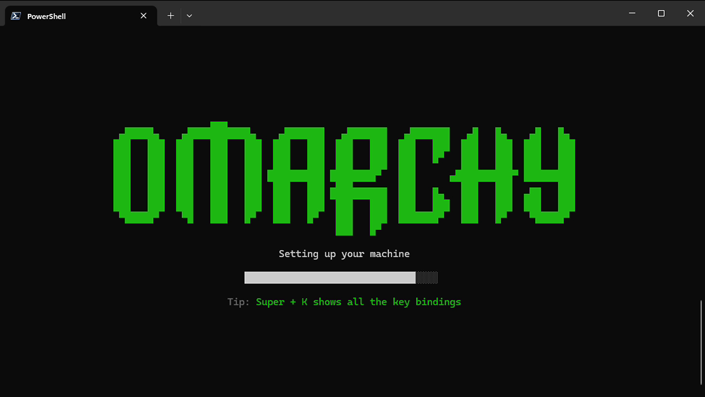
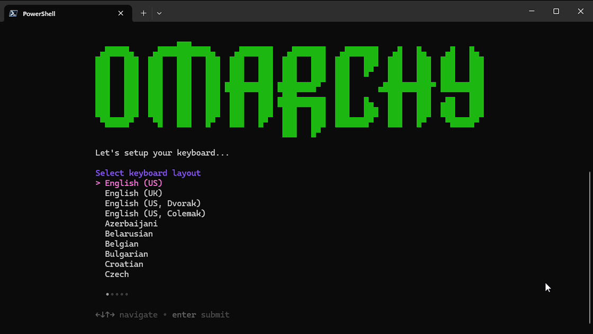
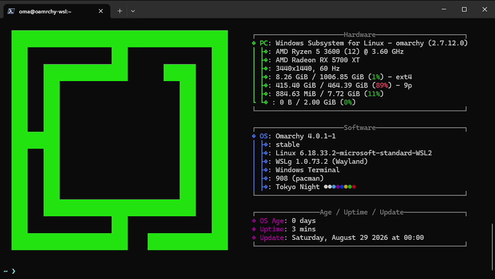

# Omarchy WSL



A builder that produces a [WSL2](https://learn.microsoft.com/en-us/windows/wsl/) distro image running the real [Omarchy](https://github.com/basecamp/omarchy) (the same package set, the same dotfiles, the same `omarchy-*` tooling) on top of the Windows-provided WSL2 kernel instead of Omarchy's own kernel/bootloader.

This is not a from-scratch reimplementation of Omarchy's look and feel. `omarchy` is a real pacman package: installing it pulls in Omarchy's actual dependency graph (Hyprland, SDDM, Limine, Quickshell, and everything else) automatically, no hand-picked list involved. The build pacstraps that package plus the ISO's own `omarchy-base.packages`, then runs Omarchy's real, unmodified install orchestration scripts (already shipped inside the package at `/usr/share/omarchy/install/`) exactly as a bare-metal install would, before layering on the minimum WSL-specific integration needed to make it boot and run under WSL2. Where something doesn't apply under WSL2, it's left out deliberately and documented, never silently stripped after the fact, and never replaced with a from-scratch reimplementation where the real thing can just run.

**Status: v1 runs without a Hyprland desktop session.** There is no Hyprland/Wayland compositor owning the whole display. Individual graphical programs still launch fine as their own windows, through WSLg's standard per-app integration (the same mechanism any WSL distro gets). See [ROADMAP.md](ROADMAP.md) for the distinction, why a full desktop session is harder, and where that's headed.

## How this differs from bare-metal Omarchy

This is the honest answer to "is it exactly like a real install": read this before anything else.

| Bare-metal Omarchy | omarchy-wsl |
|---|---|
| Own Linux kernel, `linux-firmware`, hardware `*-dkms` drivers | Uses the Windows-provided WSL2 kernel instead. Not installable under WSL2. |
| Limine bootloader, `mkinitcpio` initramfs, `snapper`/`btrfs-progs` boot-menu snapshot rollback | Installed as real `omarchy` dependencies, but unused: there is no boot sequence under WSL2 to invoke them. |
| Optional LUKS full-disk encryption | Not applicable: no block device to encrypt. The first-boot binary already handles the unencrypted case. |
| Plymouth boot splash | Installed (a dependency of `omarchy-settings`), never invoked: no initramfs hook triggers it under WSL2. |
| SDDM login greeter | Installed but not enabled. WSL2 sessions are already authenticated as the Windows user, and there is no display for SDDM to run against. |
| Hyprland owns the whole display via DRM/KMS | Installed, not launched in v1: WSL2 has no real DRM/KMS device (see [ROADMAP.md](ROADMAP.md)). |
| Individual GUI apps run inside that Hyprland session | Run through WSLg's own per-app window integration (Xwayland/Weston plus FreeRDP RAIL) instead, independent of Hyprland. Confirmed working on real hardware. |
| Interactive first-boot "machine owner" setup (`omarchy-provision-owner`) | The real, unmodified binary, triggered by WSL's own first-run mechanism (`oobe.command`, the same one Ubuntu/Debian's WSL distros use) instead of the ISO installer. |
| NetworkManager manages a real NIC | Installed but not enabled: conflicts with WSL2's own host-managed networking. |
| `ufw` firewalls the real NIC | Runs unmodified. WSL2's NAT-based networking makes its practical effect different from bare metal, but the script itself is unchanged. |
| Bluetooth, brightness, fingerprint, hybrid-GPU tooling | Installed as real `omarchy` dependencies (the `omarchy-*` CLI tools are part of the package). No matching hardware exists under WSL2. |

Everything else (packages, shell, Neovim config, theming, `omarchy-*` CLI tools, dotfiles, `etc/skel`) is the real Omarchy, unmodified.

## Requirements

- **To run the image:** Windows with WSL2, on a build of WSL that supports `systemd=true` in `wsl.conf` (WSL ≥ 0.67.6 in practice) **and** `/etc/wsl-distribution.conf`'s `oobe.command` (WSL ≥ 2.4.4, needed for `wsl --install --from-file` to trigger first-boot provisioning; see Quickstart). Check with `wsl --version`.
- **To build the image:** a Linux environment with root and a container runtime (Docker or Podman). This includes another WSL2 distro (for example Ubuntu on WSL, with Docker installed): WSL2 runs a real Linux kernel, so it works as a build host the same as any other Linux machine. Building happens in a disposable `archlinux` container, not on your Windows host and not by hand-installing in a VM. Since the real `omarchy` package pulls in its full real dependency graph (the whole Hyprland/Wayland desktop stack, not just CLI tools), expect the build to pull on the order of 1GB+ of packages and produce a multi-GB `.wsl` image, even though no Hyprland desktop session is launched in v1.

## Quickstart

### 1. Build

The .wsl image needs to be built on a Linux environment with Docker/Podman. This can be another WSL instance. For build details see [PLAN.md](./PLAN.md)

```sh
./build/build.sh
```

### 2. Install and Launch

Just double click on `omarchy-v1.wsl` in Windows Explorer. This will install and automatically launch Omarchy WSL. 

Alternatively run:

```powershell
wsl --install --from-file omarchy-v1.wsl
wsl -d omarchy
```

First launch triggers the real Omarchy owner-setup flow (username, password, hostname, timezone), it only skips the hard drive setup.



Then it drops you straight into your new user's shell:



## Project layout

```
build/     the containerized build pipeline (pacstrap the real omarchy package → run its real install scripts → WSL integration → .wsl image)
packages/  package resolution: omarchy-base.packages fetched live + the one pinned omarchy version (no vendored/curated list)
wsl/       the WSL-integration layer that has no Omarchy analogue (wsl.conf, the first-boot provisioning trigger, apply-default-user)
test/      the post-build verification/smoke-test suite
docs/      design notes, including the full install-script audit and why the architecture is what it is
.github/   CI: a manual-only workflow that runs the same build in GitHub Actions and uploads omarchy-v1.wsl as a build artifact
PLAN.md    the detailed build design
ROADMAP.md v1 scope and deferred work (Hyprland desktop, packaging format)
```

See `PLAN.md` for the full design, the researched WSL2 platform constraints behind every decision above, and the phase-by-phase build plan. See [ROADMAP.md](ROADMAP.md) for scope and what's deferred.

## Security posture

- Package installation keeps pacman signature verification on throughout: no `SigLevel = Never`, no unsigned/`--nodeps` shortcuts. The `[omarchy]` repo's own signing key is trusted via a pinned, sha256-verified `omarchy-keyring` package, not blind trust.
- The `omarchy` package version is pinned (not floating) for build stability, and the build manifest records exactly what version and upstream branch state went into an artifact.
- No default or blank passwords are baked in: the real, unmodified first-boot owner-setup flow is unchanged.
- `NetworkManager`, `sddm`, `cups`, `cups-browsed`, and `avahi-daemon` are installed (real Omarchy dependencies) but explicitly not enabled: no always-on network-facing daemons by default, no conflicting network stack.
- The final `.wsl` image is checksummed (sha256, in `build-manifest.json`).
- A WSL distro is not a sandbox: it runs with your own privileges and has access to your Windows filesystem via `/mnt/c`; treat it accordingly.

Full rationale in `PLAN.md`'s security-hardening section.

## Attribution

Built on top of [`basecamp/omarchy`](https://github.com/basecamp/omarchy) and [`omacom-io/omarchy-iso`](https://github.com/omacom-io/omarchy-iso) (MIT licensed). This project is an independent, unofficial WSL adaptation and is not affiliated with Basecamp/DHH.
